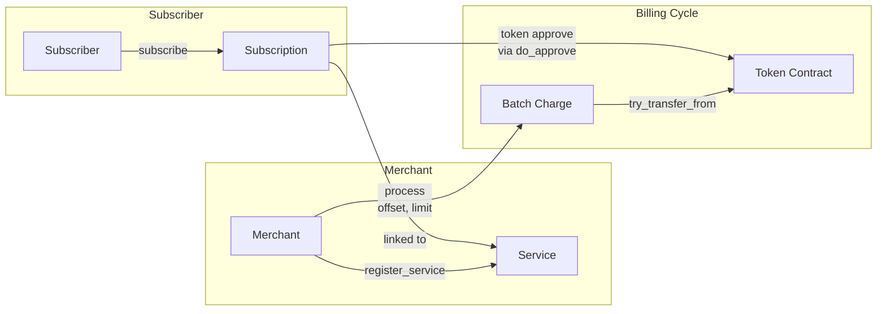
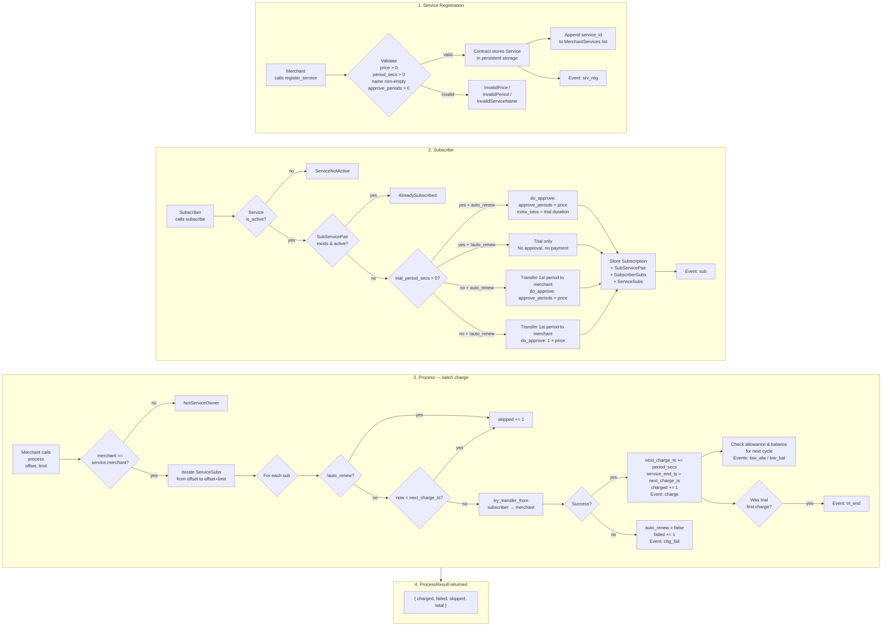

## 2. Overview

A Soroban smart contract that manages **recurring payment subscriptions**. Merchants register services with configurable pricing and billing periods. Subscribers can subscribe with or without auto-renewal, and merchants process periodic charges via pre-approved token allowances.

### Data Flow

### Key Concepts

- **Services** — Merchants define a service with a name, price per period, billing cycle duration, optional trial period, and a number of periods to pre-approve for recurring subscribers.
- **Subscriptions** — Subscribers choose a service and opt in with or without auto-renewal (`auto_renew`). The contract manages token approvals, payments, and lifecycle transitions.
- **Batch Processing** — Merchants call `process(offset, limit)` to charge due subscriptions for a given service in paginated batches. Failed payments automatically set `auto_renew = false`.
- **Token Allowances** — Payments use the `try_transfer_from` pattern with pre-approved allowances, enabling non-custodial recurring charges. Approval expiration is rounded to 720-ledger buckets for simulate/execute consistency.
- **Dedup & Trial Guard** — `SubServicePair` prevents duplicate active subscriptions. Subscribers who already used a free trial cannot re-subscribe without `auto_renew = true`.
- **No Drift** — On successful charge, `next_charge_ts` advances from its previous value (not from current time), preventing billing drift.

Next: [`3-Data-Types`](3-data-types.md)
